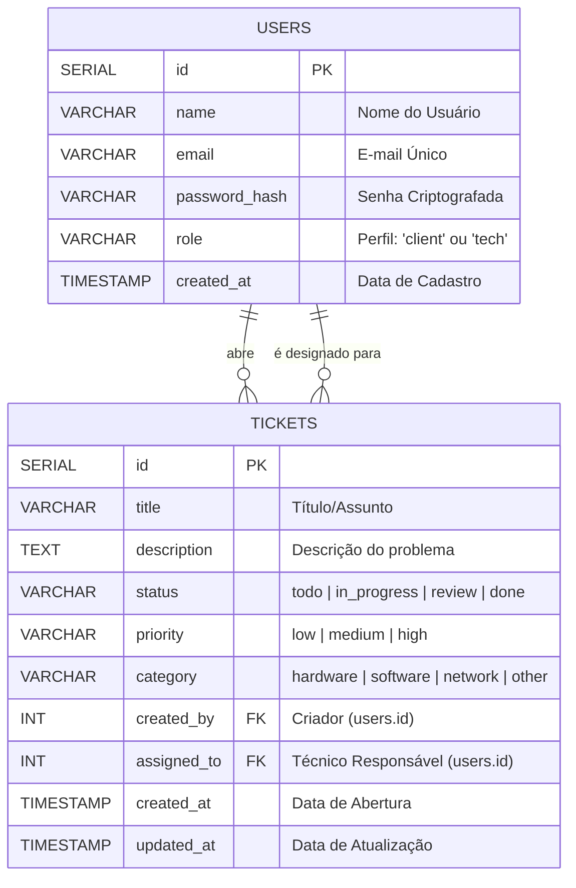

# Seu Chamado - Sistema de Chamados de TI (Kanban)

Este é um projeto acadêmico desenvolvido para a disciplina de Engenharia de Software / Desenvolvimento Web. Trata-se de um sistema de gerenciamento de chamados de suporte de TI no estilo **Kanban**, batizado de **"Seu Chamado"**.

O projeto foi projetado com foco em **usabilidade (Heurísticas de Jakob Nielsen)**, **acessibilidade (diretrizes de contraste)** e **portabilidade**, utilizando contêineres Docker para facilitar a execução sem necessidade de instalações manuais de banco de dados.

---

## 🚀 Tecnologias Utilizadas

O projeto adota uma arquitetura unificada e leve:
* **Frontend:** HTML5, CSS3 (variáveis nativas, animações de elevação e responsividade em Grid/Flexbox) e JavaScript (Vanilla JS puro para interações dinâmicas e consumo de API).
* **Backend:** Node.js com Express para fornecimento de APIs REST e arquivos estáticos.
* **Banco de Dados:** PostgreSQL 15 para persistência dos dados de acessos e chamados.
* **Autenticação:** JWT (JSON Web Tokens) armazenados em HTTP-Only Cookies (segurança contra ataques XSS).
* **Containerização:** Docker e Docker Compose.

---

## 🛠️ Arquitetura do Banco de Dados

O banco de dados é inicializado automaticamente com as tabelas de Usuários e Chamados. O diagrama abaixo representa o relacionamento lógico entre as tabelas:



---

## 🧠 Heurísticas de Usabilidade Aplicadas (Jakob Nielsen)

O projeto incorpora os seguintes conceitos fundamentais de IHC (Interação Humano-Computador):

1. **Visibilidade do status do sistema (Heurística #1):**
   * Contadores dinâmicos no topo de cada coluna do Kanban indicam o número de chamados em tempo real.
   * Modificações no status do chamado via drag-and-drop geram atualizações de interface otimistas imediatas.
2. **Compatibilidade entre o sistema e o mundo real (Heurística #2):**
   * A divisão de colunas usa nomenclaturas comuns do suporte de TI (*Pendentes*, *Em Atendimento*, *Em Revisão*, *Concluídos*).
   * Uso de ícones semânticos da biblioteca Remix Icons para representar prioridades e categorias de chamados.
3. **Controle e liberdade do usuário (Heurística #3):**
   * Opções visuais claras para fechar janelas modais, cancelar a criação de chamados ou reverter o status de forma rápida.
4. **Consistência e padrões (Heurística #4):**
   * Todos os botões, inputs e caixas de alerta seguem o mesmo padrão geométrico, de cores e espaçamentos declarados globalmente no arquivo `style.css`.
5. **Reconhecimento em vez de memorização (Heurística #6):**
   * Ao criar ou editar chamados, os usuários são listados dinamicamente em um menu de seleção. O usuário não precisa se lembrar de IDs ou e-mails específicos.
6. **Prevenção de erros e recuperação (Heurísticas #5 e #9):**
   * Validação em tempo real de inputs e alertas visuais estilizados caso o servidor retorne erros (ex: e-mail duplicado, senhas fracas).

---

## 📋 Diferenciação de Perfis (Roles)

Para simular o cenário real de uma central de chamados:
* **Cliente (Funcionário comum):** Pode criar novos chamados. Visualiza o quadro Kanban em modo leitura para acompanhar o andamento. Pode atualizar o status ou excluir **apenas os chamados criados por ele** usando o painel de detalhes.
* **Técnico de TI (Suporte):** Tem controle administrativo do Kanban. Pode arrastar qualquer chamado entre as colunas, atribuir chamados a si mesmo ou a outros membros e excluir chamados da fila.

---

## 📦 Como Executar o Projeto

### Pré-requisitos
* Ter o **Docker** e **Docker Compose** instalados na máquina.

### Executando com Docker (Recomendado)
1. Certifique-se de que o **Docker Desktop** está aberto e ativo.
2. No terminal da pasta raiz do projeto, execute:
   ```bash
   docker-compose up --build
   ```
3. Acesse no seu navegador: **[http://localhost:3000](http://localhost:3000)**.

> **💡 Conta de Teste Pré-Configurada:**
> Se o banco de dados for iniciado pela primeira vez, um técnico padrão será criado automaticamente para testes imediatos:
> * **E-mail:** `suporte@seuchamado.com.br`
> * **Senha:** `123456`

---

## 🔌 Documentação Básica da API (Endpoints)

### Autenticação (`/api/auth`)
* `POST /api/auth/register` - Cria uma nova conta.
* `POST /api/auth/login` - Valida credenciais e gera o token de acesso.
* `POST /api/auth/logout` - Limpa o cookie de sessão.
* `GET /api/auth/me` - Retorna os dados do usuário autenticado no momento.

### Usuários (`/api/users`)
* `GET /api/users` - Retorna a lista de usuários cadastrados (id, nome, email).

### Chamados (`/api/tickets`)
* `GET /api/tickets` - Retorna todos os chamados da empresa com os nomes do criador e técnico responsável.
* `POST /api/tickets` - Cria um novo chamado.
* `PUT /api/tickets/:id` - Atualiza todos os dados de um chamado.
* `PATCH /api/tickets/:id/status` - Atualiza especificamente o status do chamado (chamada otimizada para o drag-and-drop).
* `DELETE /api/tickets/:id` - Exclui permanentemente um chamado.

---

## 📁 Estrutura do Projeto

```text
seu-chamado/
├── .impeccable/         # Configurações do painel visual do design system
├── public/              # Arquivos públicos servidos ao frontend
│   ├── css/
│   │   └── style.css    # Paleta de cores, tipografia, regras CSS e transições
│   ├── js/
│   │   ├── auth.js      # Lógica de login, registro e checagem de cookies
│   │   └── kanban.js    # Controle do Kanban (Drag/Drop, render e filtros)
│   ├── index.html       # Tela de login e cadastro (Tab switcher)
│   └── dashboard.html   # Espaço de trabalho Kanban e modais de chamados
├── db.js                # Módulo de conexão com banco de dados e migrações SQL
├── server.js            # Arquivo principal do servidor Node.js/Express e rotas
├── Dockerfile           # Instruções de montagem da imagem docker do app
├── docker-compose.yml   # Orquestração do banco e app
├── .env.example         # Exemplo de configurações de rede e segurança
├── PRODUCT.md           # Definição e objetivos de negócio
└── DESIGN.md            # Regras e identidade visual detalhada
```
